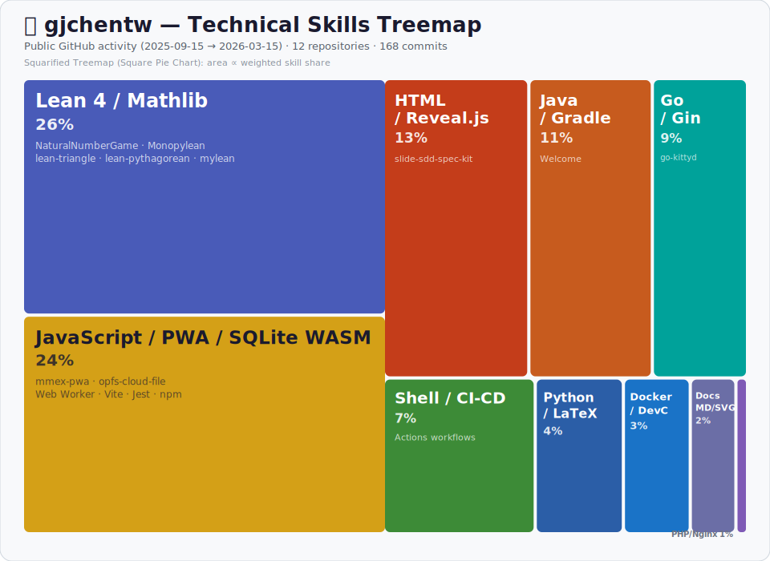

## 📊 Technical Skills — Past 6 Months

<p align="center">
  
</p>

### 技術占比明細

| 技術 | 占比 | 相關專案 | 說明 |
|:-----|:----:|:---------|:-----|
| **Lean 4** | 30% | lean-triangle, lean-pythagorean, Monopylean, NaturalNumberGame, mylean | 形式化驗證與數學定理證明（三角形內角和、畢氏定理、自然數遊戲）；41 commits |
| **JavaScript** | 18% | opfs-cloud-file | OPFS 雲端檔案同步函式庫，使用 Vite、Jest、Web Workers、npm 發布；25 commits |
| **Java / Gradle** | 15% | Welcome | Minecraft Spigot 插件開發，含投票機制、i18n、JUnit 5 測試；19 commits |
| **Go** | 12% | go-kittyd | WebSocket 終端伺服器，使用 Gin 框架，含完整測試套件；15 commits |
| **Shell / CI-CD** | 8% | *跨專案* | GitHub Actions 自動化工作流程、建構與部署腳本 |
| **HTML / Reveal.js** | 7% | slide-sdd-spec-kit | SDD 規格驅動開發的投影片工具包；31 commits |
| **Docker / DevOps** | 5% | compose-php, DevContainers | Docker Compose 部署、Lean 開發容器配置 |
| **Python / LaTeX** | 3% | NaturalNumberGame | Lean Blueprint 文檔產生器、LaTeX 數學排版 |
| **PHP / Nginx** | 2% | compose-php | PHP-FPM + Nginx 的容器化 Web 伺服器部署 |

> **分析方法**：根據過去 6 個月 (2025/09 – 2026/03) 的 12 個公開 GitHub 倉庫、135+ commits，依 commit 數量、專案複雜度與技術深度加權計算。

---

### 📝 可重複使用的 Prompt

<details>
<summary>點擊展開 — 用於產生技術能力 Square Pie Chart 的 Prompt</summary>

```
根據 GitHub 使用者 {USERNAME} 過去 6 個月的公開 GitHub 活動（repositories、commits、使用的程式語言與框架），分析其技術能力組成，並製作一張 SVG 格式的 Square Pie Chart（方形比例圖 / Treemap）。

要求：
1. 查看該使用者過去 6 個月內有活動的所有公開 repositories
2. 分析每個 repo 的主要語言、框架、工具（例如：Go、JavaScript、Docker、Lean 4 等）
3. 根據 commit 數量、專案複雜度與技術深度，計算每項技術的加權占比（百分比）
4. 生成一張精美的 SVG treemap 圖表，其中：
   - 每個方塊的面積與該技術的占比成正比
   - 使用不同顏色區分各項技術
   - 在方塊內標示技術名稱、百分比、相關專案名
   - 包含標題與時間範圍
5. 在 README 中以表格形式詳細列出每項技術的占比、相關專案與說明
6. 將 SVG 檔案放在 repo 根目錄，並在 README 中引用顯示

範例輸出格式：
- SVG 檔名：tech-skills-treemap.svg
- 圖表類型：Squarified Treemap（方形比例圖）
- 參考風格：Our World in Data 的 CO₂ 排放 treemap
```

</details>
